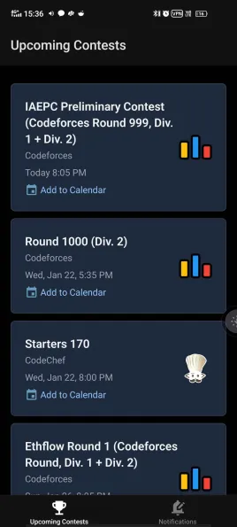

# CPsched

[onetincan.foo/CPsched](https://onetincan.foo)

CPsched aggregates upcoming contest schedules from Codeforces, Codechef and Leetcode.

### Hosted ICal
Subscribe to the ICal at [onetincan.foo/CPsched/contests.ics](https://onetincan.foo/CPsched/) with your calendar app. 
Everyday, a github runner populates the ics file with the latest contests.

### App
CPsched also has an app you can use if you do not have a calendar app that supports ical.

**Install the app [here](https://github.com/TanmayArya-1p/CPsched/releases)**
